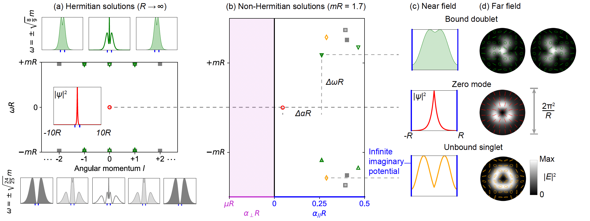

# Non-Hermitian Dirac Vortex for TCSELs

This repository provides the source code and datasets for the analytical solutions of the non-Hermitian Dirac vortex. As the non-Hermitian generalization of the Jackiw-Rossi zero mode, it constitutes the minimal theoretical framework for topological-cavity surface-emitting lasers (TCSELs).

## Physical Picture

The figure below illustrates the transition from Hermitian solutions to non-Hermitian localized states.

